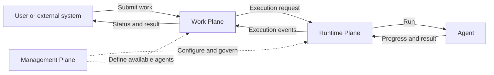

# Agentstration

> Agentstration is a local-first platform for governing, executing, and tracking work delegated to agents.

Agentstration is organized around three explicit planes:

```text
Agentstration
├── Management Plane
├── Runtime Plane
└── Work Plane
```

- **Management Plane**: configures and governs agents and the Agentstration platform.
- **Runtime Plane**: executes and orchestrates agents.
- **Work Plane**: receives, represents and tracks work delegated to agents.

> The Work Plane is where users and systems delegate work to agents, track its lifecycle, interact with ongoing executions, and retrieve results.



The management plane is the source of truth for agent definitions and desired state; runtime `AIAgent` instances are reconstructible. The Work Plane owns the functional lifecycle, interactions, history, and result of each `WorkItem`. Its architectural principle is **Microsoft-first, provider-neutral, cloud-optional**.

## Declarative agent resources

Agent declaration belongs to the Management Plane. It owns the desired state, generation, provisioning status, resource version, canonical resource identifiers, reference validation, and lifecycle events. The Runtime Plane owns dependency resolution, materialization, lifecycle, and execution. Microsoft Agent Framework is an execution implementation detail confined to the runtime adapter and does not appear in Management resources or events.

The module is physically isolated: `Agentstration.Management.Abstractions` contains its canonical resources, ports, and published events, while `Agentstration.Management.Core` contains validation and use cases. No Management model or service remains in the general Domain or Application projects.

Agents use the existing Microsoft-like resource format; no parallel manifest format is introduced:

```yaml
type: Agentstration.Agents/agents
apiVersion: 2026-08-01
name: sql-expert
resourceGroup: default
location: local
tags:
  domain: database
properties:
  displayName: SQL Expert
  description: Specialized agent for database questions.
  agentType:
    resourceId: /resourceGroups/default/providers/Agentstration.Agents/agentTypes/readonly-expert
    version: 1
  additionalInstructions: |
    Focus on SQL Server.
  modelProfile:
    resourceId: /resourceGroups/default/providers/Agentstration.Models/modelProfiles/reasoning-default
  tools:
    - resourceId: /resourceGroups/default/providers/Agentstration.Tools/tools/sql-readonly
```

The agent resource ID is `/resourceGroups/{resourceGroup}/providers/Agentstration.Agents/agents/{agentName}`. `PUT` is idempotent: an identical declaration preserves its generation and resource version, while a functional change increments the generation and publishes an independent `AgentCreated`, `AgentUpdated`, or `AgentDeleted` event.

## Work, Flow, Run, and Agent

```text
Work  = what needs to be accomplished
Flow  = how the work is routed and processed
Run   = a concrete execution
Agent = a participant in the execution
```

```text
WorkItem
    │ handled by
    ▼
FlowDefinition
    │ instantiated as
    ▼
FlowRun
    │ executed by
    ▼
Runtime
    │ mobilizes
    ▼
Agents
```

The Management Plane manages versioned Flow definitions. The Runtime Plane will instantiate and execute FlowRuns in a future increment. Supported definition kinds are `Direct`, `Routing`, `Workflow`, `Orchestration`, and `Composite`. Orchestration strategies such as Sequential, Concurrent, Handoff, GroupChat, and Magentic remain provider-neutral domain values; they do not reference Microsoft Agent Framework. `Pipeline` may describe a specialized Workflow, but it is not the root concept.

The standalone vertical uses SQLite for management resources and runs without Azure, Foundry, a remote model, or an API key. It seeds `dotnet-expert` and `sql-expert`, compiles immutable revisions, deploys them in-process, reconciles their runtime state, routes each request to one agent, and executes that agent through Microsoft Agent Framework. The existing ingestion, memory, mission, REST, Razor, and MCP verticals remain available as product capabilities.

## Prerequisites

- .NET SDK 10.0.300 or later feature band
- Optional: a local Ollama installation for the direct Web launch path
- Optional: Docker Desktop for the Aspire-managed Ollama path

No Azure subscription or remote API key is required.

## Run locally

The most direct route is:

```powershell
dotnet run --project src/Agentstration.Web
```

Open `http://localhost:5080`. Data is persisted to `src/Agentstration.Web/.agentstration/data.json` and is intentionally ignored by Git.

The same process now hosts the Blazor operations console in Interactive Server mode. Its default simulated console data makes every operational section immediately explorable without calling a remote API; the existing platform stores and REST endpoints retain their normal local behavior. See the [Web console guide](src/Agentstration.Web/README.md) for API client, authentication, rendering, and UI component configuration.

For the Aspire dashboard and orchestration experience:

```powershell
dotnet run --project src/Agentstration.AppHost
```

This profile provisions an Ollama container, persists its model cache in a Docker volume, pulls `qwen3:1.7b` on first startup, and connects the Web application to it through Aspire service discovery. Override the development model with `Agentstration__LocalModels__Chat`; the first launch can take longer while Ollama downloads it.

Or with containers:

```powershell
docker compose up --build
```

## AI modes

The default provider is deterministic and needs no model:

```powershell
$env:AI__Provider = "Deterministic"
dotnet run --project src/Agentstration.Web
```

To use an already running Ollama instance directly, without Aspire:

```powershell
ollama pull qwen3:1.7b
$env:AI__Provider = "Ollama"
$env:AI__Endpoint = "http://localhost:11434"
$env:AI__Model = "qwen3:1.7b"
dotnet run --project src/Agentstration.Web
```

The Agent Runner uses the selected `IChatClient`, so no Ollama-specific execution path exists in the Runtime Plane. In Development, a small connectivity diagnostic is also available:

```powershell
$body = @{ prompt = "Reply with one short sentence." } | ConvertTo-Json
Invoke-RestMethod -Method Post -ContentType application/json -Body $body http://localhost:5080/api/diagnostics/models/ollama/chat
```

`Agentstration.ModelProviders` defines provider resolution, `Agentstration.ModelProviders.Ollama` owns the OllamaSharp client integration, and `Agentstration.AppHost` alone owns container provisioning. `Runtime.AgentFramework` continues to depend only on `IChatClient` and has no Ollama dependency. Other OpenAI-compatible endpoints can still be configured with `AI__Endpoint`, `AI__Model`, and optional `AI__ApiKey` under a non-`Deterministic`, non-`Ollama` provider name.

## REST quickstart

### Management plane

The API follows a Microsoft-like resource shape and requires `api-version=2026-08-01`. After startup, inspect a seeded deployment:

```powershell
$base = "http://localhost:5080/resourceGroups/default/providers/Agentstration.Agents"
Invoke-RestMethod "$base/deployments/sql-expert?api-version=2026-08-01"
```

Route a request to exactly one ready agent and execute it:

```powershell
$body = @{ input = "How can I optimize this SQL query?" } | ConvertTo-Json
Invoke-RestMethod -Method Post -ContentType application/json -Body $body "$base/routing/invoke?api-version=2026-08-01"
```

Management endpoints support ETag, `If-Match`, `If-None-Match`, Problem Details, pagination, and `202 Accepted` for deployment actions. SQLite data is stored in `.agentstration/control-plane.db` by default.

### Runtime runs

The Agent Runner and Runtime API create durable executions without creating Work Items:

```powershell
$runBody = @{
  agent = @{ resourceId = "/resourceGroups/default/providers/Agentstration.Agents/agents/sql-expert"; version = 1 }
  input = @{ messages = @(@{ role = "User"; content = "Analyze this SQL query." }) }
  execution = @{ mode = "Interactive"; timeoutSeconds = 120 }
  origin = "Api"
} | ConvertTo-Json -Depth 8
$run = Invoke-RestMethod -Method Post -ContentType application/json -Body $runBody http://localhost:5080/api/runtime/runs
Invoke-RestMethod "http://localhost:5080/api/runtime/runs/$($run.id)"
```

Run history and ordered events are stored independently in `.agentstration/runtime-plane.db`. The console exposes Quick Run, advanced context/parameters, SSE progress, cancellation, retry, trace and raw inspection from each agent page.

### Content and missions

List the seeded workspace and inbox:

```powershell
$workspace = Invoke-RestMethod http://localhost:5080/api/workspaces | Select-Object -First 1
$inbox = Invoke-RestMethod "http://localhost:5080/api/workspaces/$($workspace.id.value)/inboxes" | Select-Object -First 1
```

Ingest text and inspect the asynchronous result:

```powershell
$body = @{ text = "Microsoft Agent Framework enables provider-neutral agent workflows." } | ConvertTo-Json
$accepted = Invoke-RestMethod -Method Post -ContentType application/json -Body $body "http://localhost:5080/api/workspaces/$($workspace.id.value)/inboxes/$($inbox.id.value)/items"
Start-Sleep -Seconds 1
Invoke-RestMethod "http://localhost:5080/api/workspaces/$($workspace.id.value)/items/$($accepted.itemId.value)"
```

Search memory:

```powershell
$search = @{ query = "agent"; limit = 20 } | ConvertTo-Json
Invoke-RestMethod -Method Post -ContentType application/json -Body $search "http://localhost:5080/api/workspaces/$($workspace.id.value)/memory/search"
```

Create and run a deterministic monitoring mission:

```powershell
$missionBody = @{ name="Price watch"; objective="Notify below 300"; sourceUrl="demo://product/coffee-machine"; frequencyMinutes=360; threshold=300 } | ConvertTo-Json
$mission = Invoke-RestMethod -Method Post -ContentType application/json -Body $missionBody "http://localhost:5080/api/workspaces/$($workspace.id.value)/missions"
Invoke-RestMethod -Method Post "http://localhost:5080/api/workspaces/$($workspace.id.value)/missions/$($mission.id.value)/run"
```

### Work plane

Submit work through the canonical Work Plane API:

```powershell
$body = @{ type = "question"; title = "SQL review"; instruction = "How can I optimize this SQL query?" } | ConvertTo-Json
$work = Invoke-RestMethod -Method Post -ContentType application/json -Body $body "http://localhost:5080/api/work/workitems"
Invoke-RestMethod "http://localhost:5080/api/work/workitems/$($work.id)"
Invoke-RestMethod "http://localhost:5080/api/work/workitems/$($work.id)/result"
```

The local adapter queues the request, executes it through the existing Runtime Plane, and applies stable execution events to the persisted `WorkItem`. Work data is stored independently in `.agentstration/work-plane.db`.

### Flow definitions

Create and publish a Direct Flow:

```powershell
$flow = @{
  name = "sql-direct"
  description = "Sends SQL work to the SQL expert"
  kind = "Direct"
  version = "1.0.0"
  enabled = $true
  spec = @{ specKind = "direct"; target = @{ kind = "Agent"; id = "sql-expert" } }
} | ConvertTo-Json -Depth 8
Invoke-RestMethod -Method Post -ContentType application/json -Body $flow "http://localhost:5080/api/flows"
Invoke-RestMethod -Method Post -ContentType application/json -Body (@{ version="1.0.0"; activate=$true } | ConvertTo-Json) "http://localhost:5080/api/flows/sql-direct/versions"
```

Flow definitions are stored in `.agentstration/flow-plane.db`. Published versions are immutable; a `WorkItem` may carry a lightweight exact or active `FlowReference` without embedding the definition.

## MCP

The official C# MCP SDK exposes Streamable HTTP at `http://localhost:5080/mcp`. Example VS Code `.vscode/mcp.json`:

```json
{
  "servers": {
    "agentstration": {
      "type": "http",
      "url": "http://localhost:5080/mcp"
    }
  }
}
```

Tools: `list_workspaces`, `list_inboxes`, `ingest_text`, `ingest_url`, `search_memory`, `create_mission`, `get_mission`, `list_mission_runs`, and `run_mission_now`.

## Quality gates

```powershell
dotnet build Agentstration.slnx --configuration Release
dotnet test Agentstration.slnx --configuration Release
```

Warnings are errors, .NET analyzers are enabled, and NuGet audit findings fail restore. The test suite covers the two verticals, workspace isolation, idempotency, raw preservation, routing, agent failure, MCP surface, REST startup, and dependency rules.

## AI evaluation

`Agentstration.Evaluation` contains an offline evaluator built on `Microsoft.Extensions.AI.Evaluation`. The evaluation suite runs the real ingestion and content-processing workflow with the deterministic chat client, then measures:

- valid structured output;
- lexical summary groundedness against the preserved source;
- required-fact coverage;
- expected-category coverage.

Cases are versioned in `tests/Agentstration.Evaluation.Tests/Data/content-workflow-cases.json`. Run the deterministic suite with:

```powershell
dotnet test tests/Agentstration.Evaluation.Tests --configuration Release
```

This baseline is intentionally offline and cost-free. LLM-as-judge quality evaluators and report generation remain opt-in future extensions; they must not make the default test suite depend on a remote model.

## Current boundaries

This is a product foundation, not a production multi-tenant release. FlowRun execution, semantic/LLM routing, graph scheduling, checkpoints, indirect cycle detection, durable distributed Work dispatch, requester authorization, external artifact storage, execution recovery, retries, JSON/YAML manifest import, model/tool/connection/identity resource providers, revision traffic splitting, dedicated process/container hosting, remote endpoints, Foundry bindings, runtime session storage, and management authentication remain planned.

See [architecture](docs/architecture.md), [decisions](docs/decisions/), [security](SECURITY.md), and [contributing](CONTRIBUTING.md).
