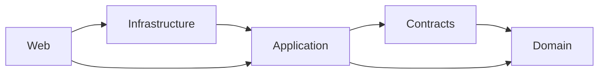

# Dependency rules

The core vertical preserves this direction:

Additional modules follow the same principle: abstractions and domain models do not depend on transport, EF Core, concrete providers, Microsoft Agent Framework, or hosts.

- Management compatibility types remain in `Management.Abstractions` only while awaiting family extraction. Identity, authorization and PAT contracts live in `Identity.Contracts`; provider-neutral audit contracts live in `Security.Contracts`; Extension registration and AEP contracts live in `Extensions.Contracts`; Pack installation, authoring and composition contracts live in `Packs.Contracts`; Source identity, publication, channels, snapshots, refresh, catalog and provider ports live in `Sources.Contracts`. Validation and use cases live in plural resource-family modules; EF Core lives in `ResourceManagement.Storage.*` or family-specific storage projects.
- Flow domain and application projects remain provider-neutral; EF Core lives in `Flow.Storage.Sqlite`.
- Work owns functional state and calls the runtime through `IWorkExecutionGateway`; Work SQLite does not share Management or Runtime storage.
- Concrete Microsoft Agent Framework types live only in `Runtime.AgentFramework`.
- Endpoints, UI components, MCP tools, workers, and `Program.cs` delegate business behavior to application services.

Architecture tests enforce important project-reference boundaries.
