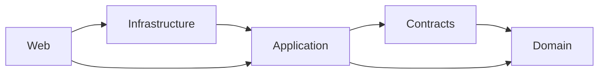

# Dependency rules

The core vertical preserves this direction:

Additional modules follow the same principle: abstractions and domain models do not depend on transport, EF Core, concrete providers, Microsoft Agent Framework, or hosts.

- Management canonical types live in `Management.Abstractions`; validation/use cases live in `Management.Core`; EF Core lives in `Management.Storage.Sqlite`.
- Flow domain and application projects remain provider-neutral; EF Core lives in `Flow.Storage.Sqlite`.
- Work owns functional state and calls the runtime through `IWorkExecutionGateway`; Work SQLite does not share Management or Runtime storage.
- Concrete Microsoft Agent Framework types live only in `Runtime.AgentFramework`.
- Endpoints, UI components, MCP tools, workers, and `Program.cs` delegate business behavior to application services.

Architecture tests enforce important project-reference boundaries.
