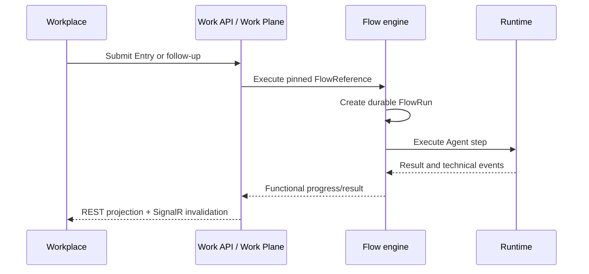

# Flow execution

A submitted Entry is resolved to an exact immutable Flow version. Work creates functional state; the Flow engine creates a durable FlowRun; Agent steps invoke Runtime; results and events are projected back into Work and Workplace.

Draft Runs retain the exact draft revision, definition hash, and immutable snapshot. Published Runs resolve an immutable semantic Flow version. Continuations create a new FlowRun and link it to the terminal predecessor.
