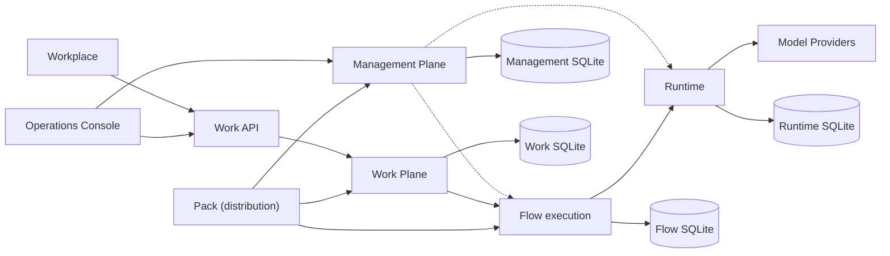

# Architecture overview

Agentstration is a modular monolith with explicit Management, Runtime, Work, and Flow boundaries. The repository currently produces multiple local hosts from one codebase: an operations Console, an autonomous Work API, an end-user Workplace, and an Aspire AppHost.

The dominant design rules are local-first operation, provider-neutral application contracts, separate persistence boundaries, reconstructible runtime objects, and shared use cases across REST, Razor, MCP, and workers.

Packs form a distribution layer above these resource owners. Installation delegates each contained manifest to its owning module and records provenance; Packs never enter the execution path. See [Packs](../concepts/packs.md) and [ADR-0035](../decisions/0035-packs-are-management-distribution-artifacts.md).

The original detailed implementation inventory remains available in [Architecture: current implementation](../architecture.md).
