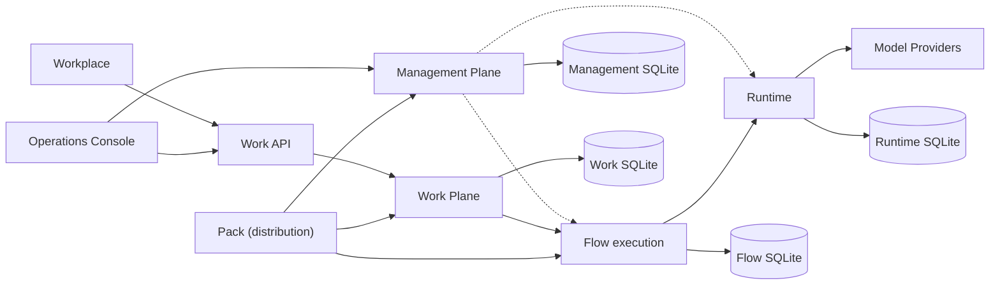

# Architecture overview

The `docs/architecture/` section is the canonical Agentstration Technical Architecture Document (DAT). [Architecture documentation conventions](conventions.md) define the ownership boundaries between LikeC4, Markdown, Mermaid, and ADRs, while the [migration inventory](migration-inventory.md) tracks the progressive consolidation of existing sources.

Agentstration is a modular monolith with explicit resource-family, Runtime, Work, and Flow boundaries. The repository contains one authoritative server/API, independently hostable Console and Workplace shells, autonomous AEP extensions, and an Aspire development orchestrator.

> The structural Mermaid overview below is transitional. It remains available until the shared LikeC4 model and its published L1–L3 views replace it without losing valid information.

```mermaid
flowchart LR
    Pack["Pack (distribution)"] --> Management
    Pack --> Flow
    Pack --> Work
    Console[Operations Console] --> Management[Management Plane]
    Console --> WorkAPI[Work API]
    Workplace[Workplace] --> WorkAPI
    WorkAPI --> Work[Work Plane]
    Work --> Flow[Flow execution]
    Flow --> Runtime[Runtime]
    Runtime --> Providers[Model Providers]
    Management -.-> Runtime
    Management -.-> Flow
    Management --> MgmtDb[(Management SQLite)]
    Work --> WorkDb[(Work SQLite)]
    Flow --> FlowDb[(Flow SQLite)]
    Runtime --> RuntimeDb[(Runtime SQLite)]
```

The dominant design rules are local-first operation, provider-neutral application contracts, separate persistence boundaries, reconstructible runtime objects, and shared use cases across REST, Razor, MCP, and workers.

Packs form a distribution layer above these resource owners. Installation delegates each contained manifest to its owning module and records provenance; Packs never enter the execution path. See [Packs](../concepts/packs.md) and [ADR-0037](../decisions/0037-packs-are-management-distribution-artifacts.md).

The original detailed implementation inventory remains available in [Architecture: current implementation](../architecture.md).
