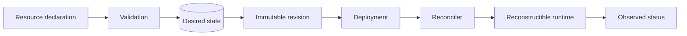

# Resource model

The Management Plane uses a small Agentstration-native declarative envelope: `uid`, `apiVersion`, `kind`, `metadata`, and a kind-specific `definition`. The logical identity is `(Workspace, Kind, metadata.name)`; the server generates the immutable UID.

`apiVersion` selects the schema and currently equals `agentstration.io/v1`. References use `{ name, workspaceRef? }`; an omitted `workspaceRef` means the current workspace. ETags protect concurrent mutations. See the [resource reference](../reference/resources/overview.md) and [versioning strategy](../reference/versioning.md).
