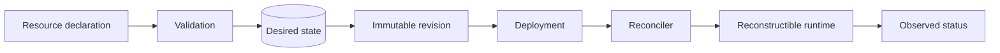

# Resource model

The Management Plane uses Azure-inspired declarative resources. Desired configuration (`properties`) is separate from observed state (`status`), and the canonical identifier is derived from resource group, provider namespace, resource type, and name.

`apiVersion` selects the schema. `generation` tracks functional changes to a resource. ETags/resource versions protect concurrent mutations. See the [resource reference](../reference/resources/overview.md) and [versioning strategy](../reference/versioning.md).
