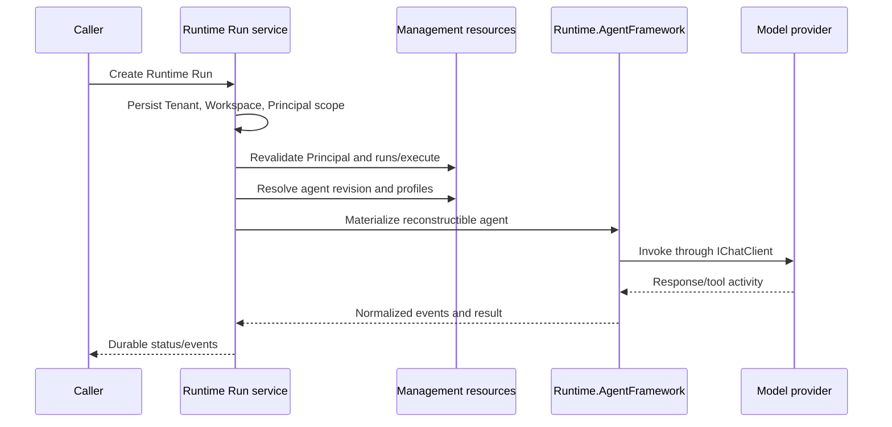

# Runtime execution

Runtime execution resolves an immutable Agent revision, its model and runtime profiles, and its tool set before creating an executable agent through the runtime adapter.

The Runtime owns technical execution, not the functional Work lifecycle. Model-provider resolution is behind application/runtime boundaries; Ollama is an optional adapter rather than a Runtime dependency.

The Runtime Run scope comes from the authenticated server context and is persisted with the Run before it is queued. It is immutable and is restored only after authorization has been revalidated. Instance-wide deployment reconciliation is different: its hosted worker opens an explicit, short-lived system scope for each iteration and never presents that authority as a user Workspace context.
