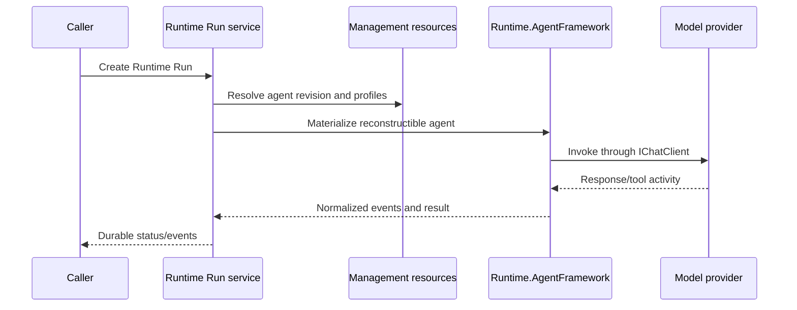

# Runtime execution

Runtime execution resolves an immutable Agent revision, its model and runtime profiles, and its tool set before creating an executable agent through the runtime adapter.

The Runtime owns technical execution, not the functional Work lifecycle. Model-provider resolution is behind application/runtime boundaries; Ollama is an optional adapter rather than a Runtime dependency.
