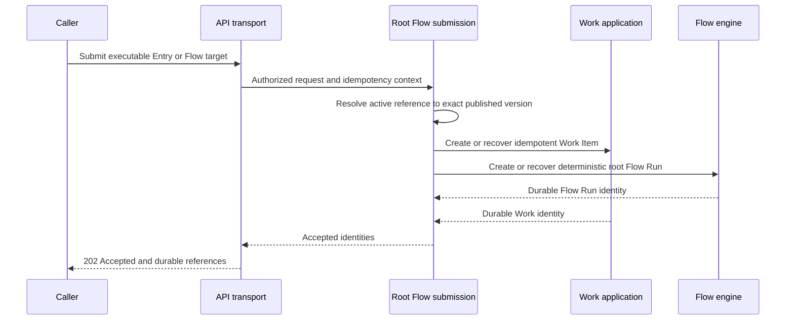
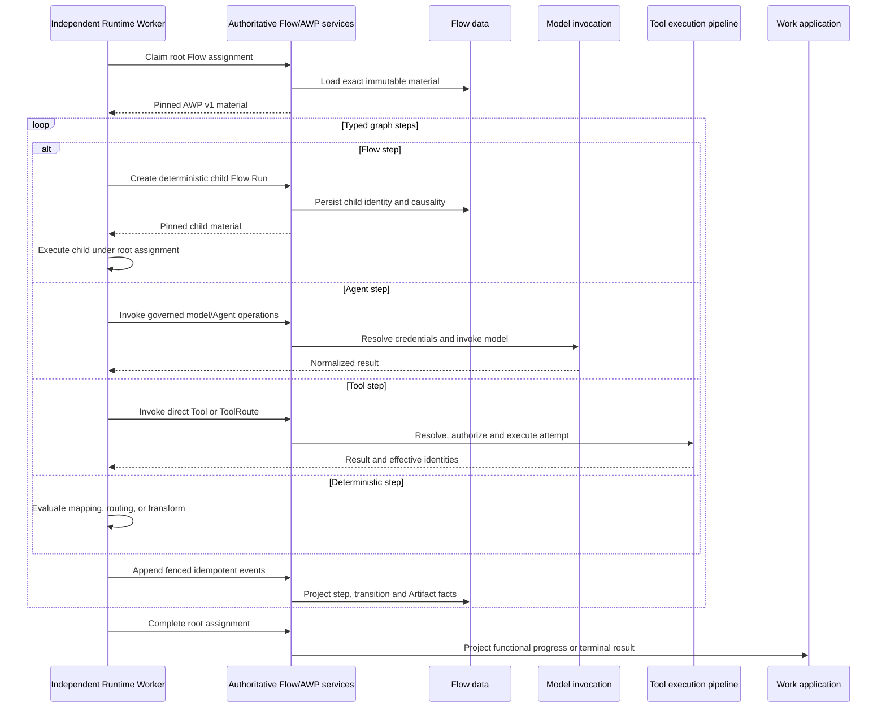
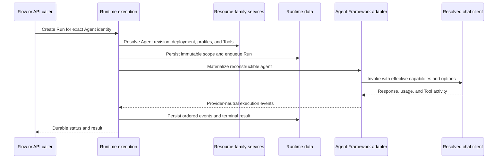
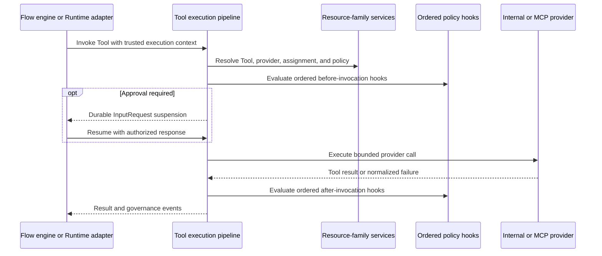
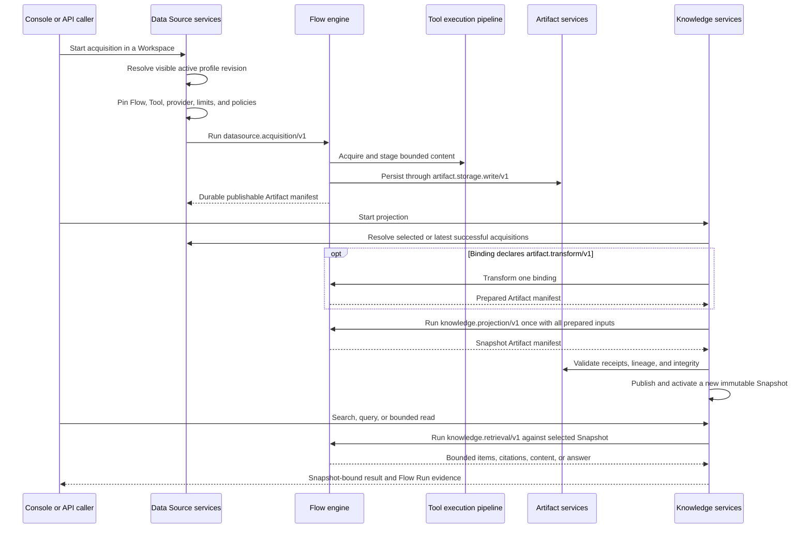
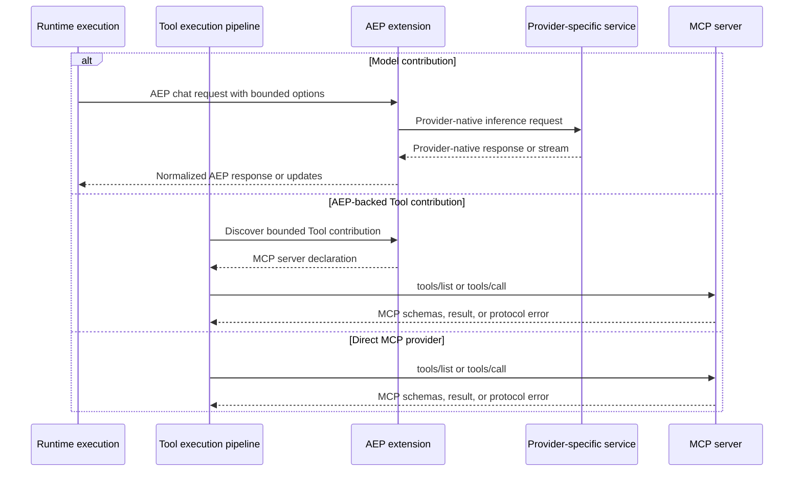

# Dynamic architecture views

These Mermaid sequence diagrams describe the principal implemented execution paths. They use names from the [interactive structural model](../interactive.mdx), but do not redefine system, container, component, or data ownership. The diagrams intentionally stop at architectural boundaries rather than tracing methods or every event.

## Submit Work

Entry, Trigger, REST, Console, and Flow-backed Tool callers converge on the same root submission boundary. Trusted execution scope comes from the authenticated context, never from caller-controlled arguments.

Structural anchors: **API transport**, **Work and Workplace application**, and **Flow engine** in the L3 view. Decisions: [ADR-0024](../../decisions/0024-entries-always-target-executable-flows.md), [ADR-0053](../../decisions/0053-workspace-scope-is-part-of-durable-identity.md), and [ADR-0106](../../decisions/0106-tool-definitions-publish-flow-backed-mcp-tools.md).

## Execute Flow

A Flow Run owns graph progress and durable Flow events. Work owns the functional lifecycle; the independent Runtime Worker owns transient MAF execution; Agentstration retains durable authority and every governed side effect.

Structural anchors: **Flow engine**, **Runtime execution**, **Tool execution pipeline**, and **Work and Workplace application**. Decisions: [ADR-0010](../../decisions/0010-independent-flow-module.md), [ADR-0019](../../decisions/0019-flow-run-resource-and-console.md), [ADR-0048](../../decisions/0048-flow-runs-carry-a-durable-execution-scope.md), [ADR-0054](../../decisions/0054-durable-interactive-flow-execution.md), [ADR-0105](../../decisions/0105-flows-compose-flows-and-governed-tools.md), and [ADR-0168](../../decisions/0168-runtime-execution-is-placed-on-independent-awp-workers.md).

## Execute Agent

Direct Console/API execution and Flow Agent steps create Runtime Runs without transferring functional Work ownership to Runtime.

Structural anchors: **Runtime execution**, **Resource-family services**, and **Runtime data**. Decisions: [ADR-0008](../../decisions/0008-reconstructible-maf-runtime.md), [ADR-0012](../../decisions/0012-runtime-run-resource.md), and [ADR-0017](../../decisions/0017-canonical-runtime-model-options-and-capabilities.md).

## Execute Tool

Flow Tool steps and Agent tool calls share one governed execution pipeline. Logical and physical-attempt identities, trusted execution scope, policy decisions, and bounded retention stay under Agentstration control.

Structural anchors: **Tool execution pipeline**, **Resource-family services**, **Flow engine**, and **Runtime execution**. Decisions: [ADR-0055](../../decisions/0055-agentstration-owns-tool-execution-boundary.md), [ADR-0056](../../decisions/0056-tool-execution-hooks-are-ordered-runtime-guards.md), [ADR-0058](../../decisions/0058-tool-governance-decisions-are-traced-per-physical-attempt.md), and [ADR-0059](../../decisions/0059-tool-arguments-require-explicit-bounded-retention.md).

## Acquire, project, and retrieve Knowledge

Data Sources own governed acquisition. Knowledge Sources consume the resulting durable Artifacts through a separate projection and expose only immutable Snapshot content to retrieval.

A projection failure leaves the previous active Snapshot unchanged. The built-in projection performs identity aggregation and preserves heterogeneous media; normalization requires an explicit transformation or specialized projection. The built-in retrieval implementation is deterministic and local-first rather than model-backed. Structural anchors: **Resource-family services**, **Flow engine**, **Tool execution pipeline**, and **Control-plane data**. Decisions: [ADR-0151](../../decisions/0151-artifacts-use-toolset-backed-staging-and-storage-flows.md), [ADR-0153](../../decisions/0153-knowledge-snapshots-are-immutable-publications.md), [ADR-0154](../../decisions/0154-knowledge-retrieval-is-a-snapshot-bound-flow-invocation.md), [ADR-0164](../../decisions/0164-data-sources-own-governed-acquisition.md), [ADR-0166](../../decisions/0166-flow-contracts-use-one-flow-owned-metadata-key.md), and [ADR-0167](../../decisions/0167-knowledge-sources-project-data-source-artifacts.md).

## Invoke AEP or MCP

AEP owns extension identity and contribution discovery, plus model contribution invocation. MCP remains authoritative for external Tool schema discovery and Tool calls; a direct MCP provider bypasses AEP.

Structural anchors: **Runtime execution**, **Tool execution pipeline**, the external **AEP extensions** system, and optional provider services. Decisions: [ADR-0026](../../decisions/0026-out-of-process-aep-model-provider-extensions.md), [ADR-0027](../../decisions/0027-aep-tool-contributions-resolve-to-mcp.md), [ADR-0028](../../decisions/0028-tool-providers-governed-catalog.md), [ADR-0065](../../decisions/0065-model-providers-bind-extension-contributions.md), and [ADR-0094](../../decisions/0094-aep-extensions-initiate-enrollment.md).
