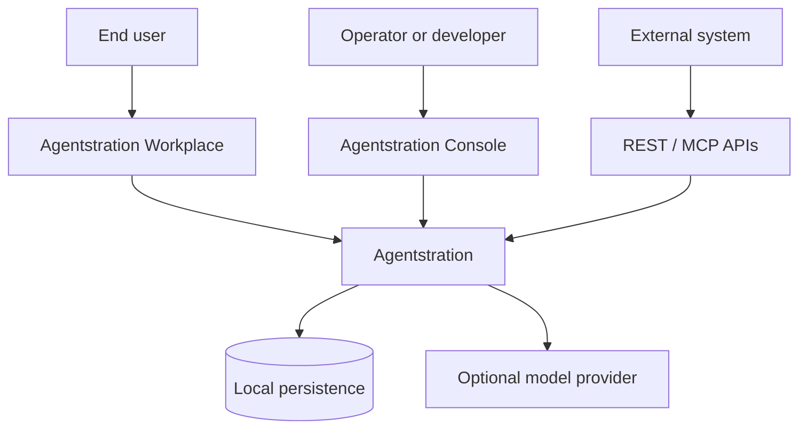

# System context

Users work through Workplace; operators govern resources and supervise execution through Console; external systems use HTTP or MCP. Agentstration persists declarations and functional state locally, then calls an optional model provider during execution.

Azure, Foundry, Ollama, Docker, and remote credentials are not mandatory system dependencies. The deterministic provider supports offline execution.
