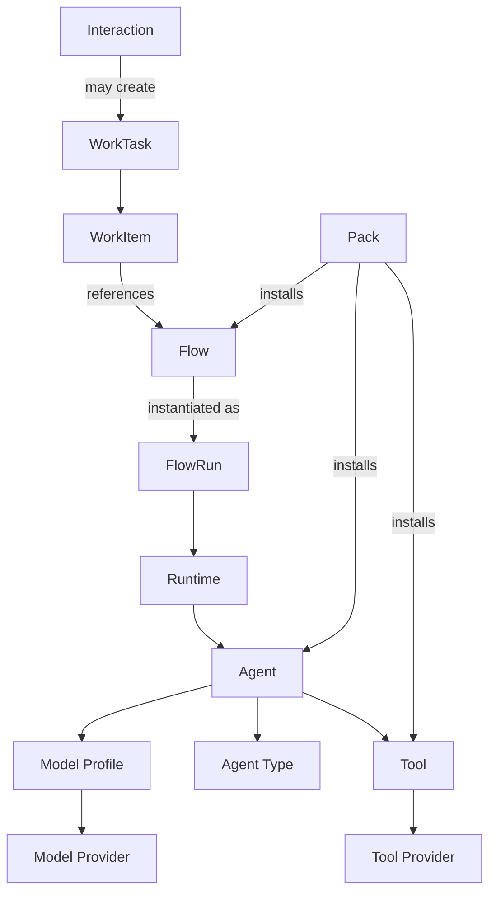

# Concepts

- [Sources](sources.md) provide stable publisher identities and retain immutable published definitions.
- [Parameters](parameters.md) hold reusable visible configuration with exact scoped references and explicit descendant-use grants.

Agentstration separates what is declared, what executes, and what users ask the system to accomplish.

| Distinction | Meaning |
| --- | --- |
| Agent ≠ Agent Type | An Agent is a governed definition; an Agent Type is a reusable behavioral template referenced by an Agent. |
| Model Provider ≠ Model Profile | A Provider describes connectivity/capabilities; a Profile expresses portable model intent and selects a provider/model. |
| Parameter ≠ Secret | A Parameter is readable nonsecret configuration; a Secret is write-only configuration resolved through a Vault. |
| Tool Provider ≠ Tool | A Tool Provider is a discoverable source; a Tool is Agentstration's governed identity with independent enablement and availability. |
| Flow ≠ FlowRun | A Flow is a versioned processing definition; a FlowRun is one durable execution of a resolved definition. |
| Interaction ≠ WorkTask | An Interaction is the durable user conversation; a WorkTask is the user-facing projection of asynchronous work. |
| Pack ≠ Resource ≠ Work | A Pack distributes resources; resources declare capability; Work and Runs are functional or technical instances. |
| Management Plane ≠ Runtime Plane | Management owns desired state; Runtime materializes and executes it. |
| Tenant ≠ Workspace | Tenant is a planned broader isolation concept; Workspace is the implemented Workplace isolation boundary. |

