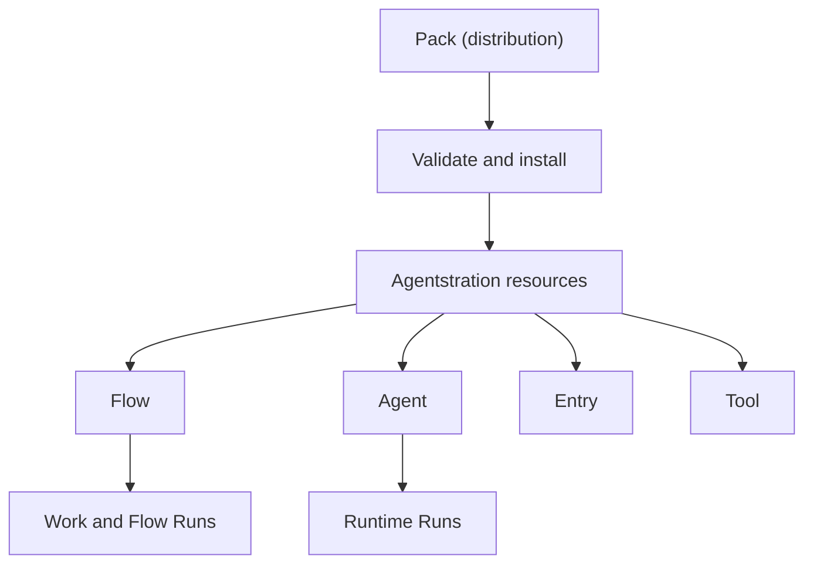

# Packs

A **Pack** is a versioned unit for distributing and installing a coherent set of Agentstration resources. It sits above the resource model and does not add a new way to execute work.

A Pack declares a `personal`, `professional`, or `universal` audience. Audience drives discovery and presentation only; it does not create a separate Pack kind, installation lifecycle, runtime, or security boundary. Legacy manifests without the field default to `universal`.



The Runtime never executes a Pack. It executes the resources that installation made available. Similarly, the Flow Router selects functional resources and does not route to Packs.

Installing `agentstration/price-watch/1.0.0` once might install a Flow, an Agent, and an Entry. Users can then create many price-watching Automations or Tasks with different products and thresholds. Those functional instances belong to Work; there is no corresponding `PackInstance`.

## Pack, resource, and work

| Concept | Owns |
| --- | --- |
| Pack | Distribution, discovery metadata, package version, requirements, installation, provenance, update, and uninstall. |
| Resource | An Agentstration declaration such as an Agent, Flow, Entry, Tool, or Model Profile. |
| Work | Functional and execution state such as a Task, Automation, FlowRun, or Runtime Run. |

Pack configuration is installation-wide policy or connectivity. Work configuration is input for one functional instance. For example, a Price Watch Pack may impose a minimum polling interval while each Automation owns its product URL and threshold.

## Identity and provenance

A Pack has a publisher, stable name, and version. The conceptual coordinate is:

```text
publisher/name/version
agentstration/price-watch/1.0.0
```

Agentstration records an installed Pack separately from the resources it manages. Each installed resource retains provenance so update and uninstall can detect local edits, detached resources, and conflicts instead of silently overwriting or deleting them.

See the [planned Pack format](../reference/packs.md) and [ADR-0037](../decisions/0037-packs-are-management-distribution-artifacts.md).
