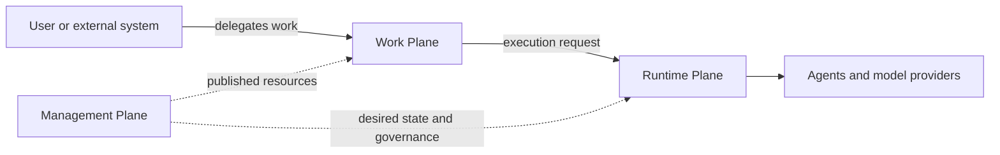

# Agentstration documentation

Agentstration is an open-source, self-hosted platform for governing, executing, and tracking work delegated to agents. It is Microsoft-first, provider-neutral, cloud-optional, and executable with local deterministic defaults.

This site is the documentation for the current development branch (**Next**). Agentstration is in `0.x` development, so public contracts may still change.

## Choose a path

- **Run Agentstration:** start with [Getting started](getting-started/overview.md).
- **Learn the model:** read [Concepts](concepts/overview.md).
- **Understand the codebase:** explore [Architecture](architecture/overview.md).
- **Look up a contract:** use the [Reference](reference/overview.md).
- **Configure identity and access:** read the [Identity and authorization reference](reference/identity-and-authorization.md).
- **Understand why:** consult the [Architecture Decision Records](decisions/index.md).
- **Contribute:** read the [contributor guide](contributing/overview.md).

The Markdown and MDX files under `docs/` are the single source of truth. `docs/site/` only contains the Docusaurus renderer.
