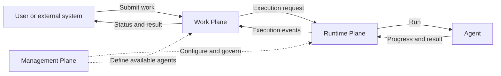

# Current capabilities and detailed workflows

> Agentstration is a local-first platform for governing, executing, and tracking work delegated to agents.

Agentstration is organized around three explicit planes:

```text
Agentstration
├── Management Plane
├── Runtime Plane
└── Work Plane
```

- **Management Plane**: configures and governs agents and the Agentstration platform.
- **Runtime Plane**: executes and orchestrates agents.
- **Work Plane**: receives, represents and tracks work delegated to agents.

> The Work Plane is where users and systems delegate work to agents, track its lifecycle, interact with ongoing executions, and retrieve results.



The management plane is the source of truth for agent definitions and desired state; runtime `AIAgent` instances are reconstructible. The Work Plane owns the functional lifecycle, interactions, history, and result of each `WorkItem`. Its architectural principle is **Microsoft-first, provider-neutral, cloud-optional**.

Packs are a Management/distribution concept above these planes: they install ordinary resources and retain provenance, but they are never run. Local ZIP installation, installed-Pack inventory, compensating failure handling, modification-safe uninstall, and six resource handlers are implemented through the Management API. See [Pack format and lifecycle](packs.md).

## Declarative agent resources

Agent declaration belongs to the Management Plane. It owns the desired state, generation, provisioning status, resource version, canonical resource identifiers, reference validation, and lifecycle events. The Runtime Plane owns dependency resolution, materialization, lifecycle, and execution. Microsoft Agent Framework is an execution implementation detail confined to the runtime adapter and does not appear in Management resources or events.

The module is physically isolated: `Agentstration.Management.Abstractions` contains its canonical resources, ports, and published events, while `Agentstration.Management.Core` contains validation and use cases. No Management model or service remains in the general Domain or Application projects.

Agents use the Agentstration-native resource envelope in both JSON and YAML:

```yaml
apiVersion: agentstration.io/v1
kind: Agent
metadata:
  name: sql-expert
  tags:
    domain: database
  annotations: {}
definition:
  displayName: SQL Expert
  description: Specialized agent for database questions.
  handler: prompt-agent
  instructions: |
    Focus on SQL Server.
  modelProfile:
    name: reasoning-default
  tools:
    - name: sql-readonly
```

The server generates an immutable UID; logical identity is `(Workspace, Agent, metadata.name)`. `PUT` is idempotent and conditional writes use ETags.

## Tool Providers and discovery

The Management Plane persists `Agentstration.Tools/toolProviders` and the `Agentstration.Tools/tools` resources materialized by discovery. Tool Providers support AEP and MCP; MCP connections support STDIO and Streamable HTTP using the official SDK. Creation/configuration performs an initial discovery attempt and the Console exposes manual test and refresh operations. Refresh reports new, changed, unchanged, and unavailable counts without deleting disappeared tools or overwriting enablement.

AEP itself is staged as an autonomous repository under `aep/`, with protocol `2026-08-01`, canonical discovery at `/.well-known/aep`, versioned capability descriptors, a reusable validator and tracing client, a headless CLI, a generic sample, and a standalone Blazor Inspector. Agentstration uses local project references during extraction and can switch to versioned packages with `UseLocalAepProjects=false` after publication.

The Tools Console separates Providers and Catalog, displays provider status and schemas, and defaults every newly discovered tool to disabled. The Agent editor assigns canonical Tool resource IDs and warns when an existing assignment is unavailable. Runtime resolution requires provider enabled, tool enabled, tool available, and assignment before passing the official MCP `AITool` to MAF.

## Work, Flow, Run, and Agent

Published Workplace Entries always target an immutable Flow version. The Console may present Agent or Flow as an authoring convenience; an Agent selection is normalized at publication through a hidden system-managed Direct Agent Flow. Consequently every submitted Entry follows `Entry -> FlowReference -> FlowRun -> Runtime`.

```text
Work  = what needs to be accomplished
Flow  = how the work is routed and processed
Run   = a concrete execution
Agent = a participant in the execution
```

```text
WorkItem
    │ handled by
    ▼
FlowDefinition
    │ instantiated as
    ▼
FlowRun
    │ executed by
    ▼
Runtime
    │ mobilizes
    ▼
Agents
```

The Flow module manages editable graph drafts, immutable published versions, and durable Flow Runs. Its local sequential executor supports typed `Input`, `Agent`, `Router`, `Condition`, `Transform`, `Output`, and `Failure` steps through provider-neutral contracts. The earlier `Direct`, `Routing`, `Workflow`, `Orchestration`, and `Composite` specifications remain compatible with the same Flow resource and storage boundary.

The standalone vertical uses SQLite for management resources and runs without Azure, Foundry, a remote model, or an API key. It seeds `dotnet-expert` and `sql-expert`, compiles immutable revisions, deploys them in-process, reconciles their runtime state, routes each request to one agent, and executes that agent through Microsoft Agent Framework. The existing ingestion, memory, mission, REST, Razor, and MCP verticals remain available as product capabilities.

## Prerequisites

- .NET SDK 10.0.300 or later feature band
- Optional: a local Ollama installation for the managed Ollama profile, including Aspire launches

No Azure subscription or remote API key is required.

## Run locally

The most direct route is:

```powershell
dotnet run --project src/Agentstration.Web
```

Open the Console at `http://localhost:5100`. The same process hosts all Management, Runtime, Flow, Work, Workplace, content, MCP, and SignalR surfaces. Data is persisted to `src/Agentstration.Web/.agentstration/data.json` and is intentionally ignored by Git.

The end-user Workplace remains an autonomous UI host. Start the authoritative server and UI in separate terminals:

```powershell
$env:AI__Provider = "Deterministic"
dotnet run --project src/Agentstration.Web
dotnet run --project src/Agentstration.Workplace.Web
```

Open `http://localhost:5180`; its API defaults to `http://localhost:5100`. The responsive UX uses the same design system and visual language as the Console while retaining end-user vocabulary. See [the Workplace guide](../workplace.md).

The Console Tasks section at `/tasks` supervises the real WorkTasks exposed by Work API. It uses server-side pagination and SignalR updates, remains readable when Workplace is stopped, and never substitutes fictitious Tasks when Work API is unavailable.

The same process now hosts the Blazor operations console in Interactive Server mode. Agent and model management always use the canonical persisted HTTP APIs; unrelated dashboard projections remain simulated by default so every operational section is immediately explorable. See the [Web console guide](https://github.com/gbaudrit/microsoft-agent-framework/blob/main/src/Agentstration.Web/README.md) for API client, authentication, rendering, and UI component configuration.

For the Aspire dashboard and orchestration experience:

```powershell
dotnet run --project src/Agentstration.AppHost
```

The AppHost exposes the authoritative server, Workplace, and autonomous extensions as separate resources and wires them through service discovery. It connects the Ollama extension to the existing local Ollama installation configured by `Ollama:Endpoint` (default `http://localhost:11434`); it does not provision an Ollama server or model. Aspire preserves the server's normal `Managed` mode; deterministic execution remains an explicit offline/test override.

Or with containers:

```powershell
docker compose up --build
```

## AI modes

The normal `Managed` mode resolves the provider, endpoint, and model from the persisted Model Profile and Model Provider selected on each agent. It is the default for direct Web and Aspire launches; no `AI__Provider=Ollama` environment variable is required. The seeded `ollama-local` Model Provider URL, editable from `/modelproviders/default/ollama-local`, is the AEP extension URL and never the native Ollama URL.

Use the deterministic offline mode explicitly for tests or fallback diagnostics:

```powershell
$env:AI__Provider = "Deterministic"
dotnet run --project src/Agentstration.Web
```

Before using the managed Ollama profile, ensure the local server and selected model are available:

```powershell
ollama pull qwen3:1.7b
$env:Ollama__Endpoint = "http://localhost:11434"
dotnet run --project src/Agentstration.AppHost
```

The seeded `reasoning-default` profile resolves to the persisted `ollama-local` AEP contribution and its `qwen3:1.7b` model. Aspire injects the autonomous Ollama extension endpoint and passes `Ollama:Endpoint` to that extension. To target a non-default local address, set `Ollama__Endpoint` before starting the AppHost. Direct startup of the extension defaults to `http://localhost:11434`, while Agentstration’s persisted AEP endpoint defaults to `http://localhost:5260`. The persisted AEP endpoint can be edited without restarting the host and is authoritative for subsequent runtime resolution.

The Agent Runner uses this resolver through Microsoft Agent Framework, so no Ollama-specific execution path exists in the Runtime Plane. Create a normal durable Runtime Run to exercise the entire declared-agent path:

```powershell
$agentId = "sql-expert"
$body = @{
  agent = @{ resourceId = $agentId; version = 1 }
  input = @{ messages = @(@{ role = "User"; content = "Quelle est la différence entre WHERE et HAVING ?" }) }
  execution = @{ mode = "Interactive"; timeoutSeconds = 120 }
  origin = "Api"
} | ConvertTo-Json -Depth 8
Invoke-RestMethod -Method Post -ContentType application/json -Body $body http://localhost:5100/api/runtime/runs
```

The returned Run is processed asynchronously and exposes `status.modelProvider`, `status.resolvedModel`, and the final response when complete. In Development, the smaller connectivity diagnostic remains available:

```powershell
$body = @{ prompt = "Reply with one short sentence." } | ConvertTo-Json
Invoke-RestMethod -Method Post -ContentType application/json -Body $body http://localhost:5100/api/diagnostics/models/ollama/chat
```

`Agentstration.Management.Core` owns persisted profile definitions and projects them into the provider-neutral resolver. `Agentstration.ModelProviders` reaches provider contributions only through AEP. The autonomous `Agentstration.Extensions.Ollama` service alone owns OllamaSharp, while `Agentstration.AppHost` owns orchestration. `Runtime.AgentFramework` consumes `IChatClient`; it has no AEP or Ollama dependency.

Current limitations are deliberate: Ollama is the only mutable provider type, credentials are not stored on provider resources, and there is no parallel Flow execution, conversation persistence, or provider-native streaming yet. Other OpenAI-compatible endpoints still use the legacy host-level `AI__Endpoint`, `AI__Model`, and optional `AI__ApiKey` settings.

### Model provider and profile APIs

Model providers are durable Management Plane resources with CRUD, ETag concurrency, usage visibility, deletion protection, connectivity testing, and dynamic model discovery. Aspire starts the AEP extension and supplies its initial seed URL, but relies on the configured local Ollama installation and remains outside the provider source of truth:

```powershell
Invoke-RestMethod http://localhost:5100/api/modelproviders
Invoke-RestMethod http://localhost:5100/api/modelproviders/ollama-local/status
Invoke-RestMethod http://localhost:5100/api/modelproviders/ollama-local/models
Invoke-RestMethod -Method Post http://localhost:5100/api/modelproviders/ollama-local/test
Invoke-RestMethod http://localhost:5100/api/modelproviders/ollama-local/usages
```

Create or edit a local Ollama declaration from the Blazor console at `/modelproviders`. Provider URLs must be absolute HTTP(S) URLs without embedded credentials, query strings, or fragments. Saving a provider does not require Ollama to be online; health and installed models remain observed state. Deleting a provider is rejected while a model profile references its exact resource ID.

Model profiles are durable Management Plane resources with ETag concurrency and usage protection:

```powershell
Invoke-RestMethod http://localhost:5100/api/modelprofiles
Invoke-RestMethod http://localhost:5100/api/modelprofiles/reasoning-default/resolution
Invoke-RestMethod http://localhost:5100/api/modelprofiles/reasoning-default/usages
Invoke-RestMethod http://localhost:5100/api/agents/sql-expert/model
```

Model profiles separate portable `generation`, `reasoning`, and `output` intent from provider-keyed `providerOptions`. V1 has no legacy `options` shape: reset/reseed the local control-plane database after upgrading from an earlier development snapshot. Runtime behavior is represented independently by `RuntimeProfileResource`; streaming is an execution/runtime option, not a model-profile property. The MAF adapter maps these canonical values to `ChatOptions` and normalized Agentstration execution events, while the Ollama adapter owns `think`, `keepAlive`, engine options, and the chat-versus-generate compatibility check.

The seeded `reasoning-default` profile references the stable `ollama-local` provider resource and `qwen3:1.7b`. Profiles remain valid when Ollama or a selected model is temporarily unavailable; only structurally invalid profiles are rejected. An in-use profile cannot be deleted. Agent definitions continue to persist only the model-profile resource ID.

The Blazor console exposes this vertical through `/modelproviders`, `/modelprofiles`, `/runtimeprofiles`, the agent editor, and the Agent Runner. Provider pages create and edit declarations, test connectivity, show dynamic models and usages, and enforce ETag/deletion protection. Model profile pages edit all canonical inference categories; runtime profile pages manage session, tool invocation, streaming, and runtime-specific options with ETag conflict and usage protection. The runner shows the resolved runtime profile and lets an advanced run choose its streaming mode. The reusable agent picker saves only `modelProfile.resourceId`; agent details render the declared profile separately from the resolved provider and model.

## REST quickstart

### Management plane

After startup, inspect a seeded deployment:

```powershell
$base = "http://localhost:5100/api"
Invoke-RestMethod "$base/deployments/sql-expert"
```

Route a request to exactly one ready agent and execute it:

```powershell
$body = @{ input = "How can I optimize this SQL query?" } | ConvertTo-Json
Invoke-RestMethod -Method Post -ContentType application/json -Body $body "$base/routing/invoke"
```

Management endpoints support ETag, `If-Match`, `If-None-Match`, Problem Details, pagination, and `202 Accepted` for deployment actions. SQLite data is stored in `.agentstration/control-plane.db` by default.

### Runtime runs

The Agent Runner and Runtime API create durable executions without creating Work Items:

```powershell
$runBody = @{
  agent = @{ resourceId = "sql-expert"; version = 1 }
  input = @{ messages = @(@{ role = "User"; content = "Analyze this SQL query." }) }
  execution = @{ mode = "Interactive"; timeoutSeconds = 120 }
  origin = "Api"
} | ConvertTo-Json -Depth 8
$run = Invoke-RestMethod -Method Post -ContentType application/json -Body $runBody http://localhost:5100/api/runtime/runs
Invoke-RestMethod "http://localhost:5100/api/runtime/runs/$($run.id)"
```

Run history and ordered events are stored independently in `.agentstration/runtime-plane.db`. The console exposes Quick Run, advanced context/parameters, SSE progress, cancellation, retry, trace and raw inspection from each agent page.

Agent management and Agent Runner always call the canonical Management and Runtime APIs, even when the remaining console dashboard uses simulated projections. Saving an agent activates its current generation; **Reconcile runtime** retries that idempotent activation manually. A successful replacement is made ready before superseded instances are deprovisioned. A Run resolves the current persisted Model Profile, invokes the deployment model through Microsoft Agent Framework and the selected provider, and records the provider, model, temperature, and maximum output tokens actually used. Advanced overrides accept only `temperature` and `maxOutputTokens`; provider, endpoint, and model overrides are rejected.

### Content and missions

List the seeded workspace and inbox:

```powershell
$workspace = Invoke-RestMethod http://localhost:5100/api/workspaces | Select-Object -First 1
$inbox = Invoke-RestMethod "http://localhost:5100/api/workspaces/$($workspace.id.value)/inboxes" | Select-Object -First 1
```

Ingest text and inspect the asynchronous result:

```powershell
$body = @{ text = "Microsoft Agent Framework enables provider-neutral agent workflows." } | ConvertTo-Json
$accepted = Invoke-RestMethod -Method Post -ContentType application/json -Body $body "http://localhost:5100/api/workspaces/$($workspace.id.value)/inboxes/$($inbox.id.value)/items"
Start-Sleep -Seconds 1
Invoke-RestMethod "http://localhost:5100/api/workspaces/$($workspace.id.value)/items/$($accepted.itemId.value)"
```

Search memory:

```powershell
$search = @{ query = "agent"; limit = 20 } | ConvertTo-Json
Invoke-RestMethod -Method Post -ContentType application/json -Body $search "http://localhost:5100/api/workspaces/$($workspace.id.value)/memory/search"
```

Create and run a deterministic monitoring mission:

```powershell
$missionBody = @{ name="Price watch"; objective="Notify below 300"; sourceUrl="demo://product/coffee-machine"; frequencyMinutes=360; threshold=300 } | ConvertTo-Json
$mission = Invoke-RestMethod -Method Post -ContentType application/json -Body $missionBody "http://localhost:5100/api/workspaces/$($workspace.id.value)/missions"
Invoke-RestMethod -Method Post "http://localhost:5100/api/workspaces/$($workspace.id.value)/missions/$($mission.id.value)/run"
```

### Work plane

Submit work through the canonical Work Plane API:

```powershell
$body = @{ type = "question"; title = "SQL review"; instruction = "How can I optimize this SQL query?" } | ConvertTo-Json
$work = Invoke-RestMethod -Method Post -ContentType application/json -Body $body "http://localhost:5100/api/work/workitems"
Invoke-RestMethod "http://localhost:5100/api/work/workitems/$($work.id)"
Invoke-RestMethod "http://localhost:5100/api/work/workitems/$($work.id)/result"
```

The local adapter queues the request, executes it through the existing Runtime Plane, and applies stable execution events to the persisted `WorkItem`. Work data is stored independently in `.agentstration/work-plane.db`.

### Flow definitions

Create and publish a Direct Flow:

```powershell
$flow = @{
  name = "sql-direct"
  description = "Sends SQL work to the SQL expert"
  kind = "Direct"
  version = "1.0.0"
  enabled = $true
  spec = @{ specKind = "direct"; target = @{ kind = "Agent"; id = "sql-expert" } }
} | ConvertTo-Json -Depth 8
Invoke-RestMethod -Method Post -ContentType application/json -Body $flow "http://localhost:5100/api/flows"
Invoke-RestMethod -Method Post -ContentType application/json -Body (@{ version="1.0.0"; activate=$true } | ConvertTo-Json) "http://localhost:5100/api/flows/sql-direct/versions"
```

Flow definitions are stored in `.agentstration/flow-plane.db`. Published versions are immutable; a `WorkItem` may carry a lightweight exact or active `FlowReference` without embedding the definition.

The Flow console at `/flows` provides creation templates, a four-zone visual designer, Designer/Definition/Split modes, YAML source editing, validation, optimistic draft saving, publication, published versions and per-Flow Runs. The specialized UI lives in the `Agentstration.Web.FlowDesigner` Razor Class Library: Z.Blazor.Diagrams owns canvas interaction and BlazorMonaco provides the locally served Monaco editor, while `Agentstration.Web` supplies backend and resource adapters. A Draft Run validates its JSON input and retains its exact draft revision, hash, and immutable definition snapshot. Run details receive differential SignalR events with replay from persisted history; `/flowruns` provides the global searchable Run history. Flow data remains in the independent `.agentstration/flow-plane.db` store.

## MCP

The official C# MCP SDK exposes Streamable HTTP at `http://localhost:5100/mcp`. Example VS Code `.vscode/mcp.json`:

```json
{
  "servers": {
    "agentstration": {
      "type": "http",
      "url": "http://localhost:5100/mcp"
    }
  }
}
```

Tools: `list_workspaces`, `list_inboxes`, `ingest_text`, `ingest_url`, `search_memory`, `create_mission`, `get_mission`, `list_mission_runs`, and `run_mission_now`.

## Runtime and MAF observability

GenAI observability is enabled by default without capturing prompts or responses. A Runtime Run produces correlated OpenTelemetry spans for the Runtime lifecycle, the Microsoft Agent Framework invocation, the effective `IChatClient` request, and the outbound HTTP call. Structured Runtime logs carry the same Run and agent correlation scope.

Run through Aspire to inspect traces, metrics, and logs in the local dashboard:

```powershell
dotnet run --project src/Agentstration.AppHost
```

For a direct Web launch, set `OTEL_EXPORTER_OTLP_ENDPOINT` to any OTLP-compatible collector. Disable GenAI instrumentation, without affecting normal execution, with:

```json
{
  "Observability": {
    "GenAI": {
      "Enabled": false
    }
  }
}
```

Prompt, response, function argument, function result, credential, and authorization-header capture is intentionally unavailable in the default logging pipeline. Runtime inputs and outputs remain inspectable through the Runtime Run API and console rather than being duplicated into operational telemetry.

For local troubleshooting only, Development can capture the final JSON body sent by the legacy OpenAI-compatible HTTP transport. AEP and the out-of-process Ollama extension do not capture prompt or response payloads by default:

```json
{
  "Observability": {
    "GenAI": {
      "HttpPayloadCapture": {
        "Enabled": true,
        "MaximumBodyLength": 16384,
        "CaptureResponse": false
      }
    }
  }
}
```

The capture creates a correlated `gen_ai.http.payload_capture` span between the GenAI `chat` span and the network `POST`, and also emits structured payload logs. It removes URI query strings, never records HTTP headers, recursively redacts common JSON credential fields, and truncates the captured value. The application refuses to start with this option outside `Development`. Capturing responses is disabled by default because it buffers the complete response and therefore changes streaming behavior. These spans and logs are exported through OTLP when an exporter is configured, so the collector and its retention policy must be treated as containing sensitive data.

## Quality gates

```powershell
dotnet build Agentstration.slnx --configuration Release
dotnet test Agentstration.slnx --configuration Release
```

Warnings are errors, .NET analyzers are enabled, and NuGet audit findings fail restore. The test suite covers the two verticals, workspace isolation, idempotency, raw preservation, routing, agent failure, MCP surface, REST startup, and dependency rules.

## AI evaluation

`Agentstration.Evaluation` contains an offline evaluator built on `Microsoft.Extensions.AI.Evaluation`. The evaluation suite runs the real ingestion and content-processing workflow with the deterministic chat client, then measures:

- valid structured output;
- lexical summary groundedness against the preserved source;
- required-fact coverage;
- expected-category coverage.

Cases are versioned in `tests/Agentstration.Evaluation.Tests/Data/content-workflow-cases.json`. Run the deterministic suite with:

```powershell
dotnet test tests/Agentstration.Evaluation.Tests --configuration Release
```

This baseline is intentionally offline and cost-free. LLM-as-judge quality evaluators and report generation remain opt-in future extensions; they must not make the default test suite depend on a remote model.

## Current boundaries

This is a product foundation, not a production multi-tenant release. Pack dependency resolution, updates, signatures and Gallery access, parallel Flow scheduling, loops, waits, approvals, subflows, semantic/LLM routing, checkpoints, durable distributed Work dispatch, requester authorization, external artifact storage, execution recovery, retries, advanced connection/identity providers, revision traffic splitting, dedicated process/container hosting, Foundry bindings, runtime session storage, and management authentication remain planned.

See [architecture](../architecture.md), [decisions](../decisions/index.md), [security](https://github.com/gbaudrit/microsoft-agent-framework/blob/main/SECURITY.md), and [contributing](https://github.com/gbaudrit/microsoft-agent-framework/blob/main/CONTRIBUTING.md).
