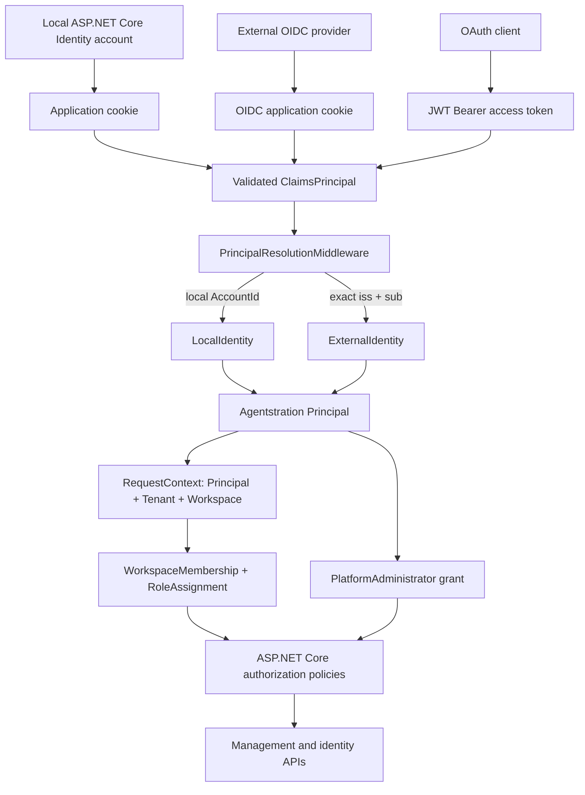

# Identity and authorization reference

This document is the consolidated description of the identity vertical implemented in Agentstration. It describes current behavior, not a target architecture. The normative decisions are ADR-0039 through ADR-0044.

## Delivered scope

Agentstration now provides:

- local accounts backed by ASP.NET Core Identity;
- interactive OIDC authentication and JWT Bearer validation through standard ASP.NET Core handlers;
- a provider-neutral Agentstration `Principal` resolved from every authenticated caller;
- exact external identity mapping by `(Issuer, Subject)`;
- canonical Tenant and Workspace memberships;
- built-in Workspace roles and contextual permissions;
- a distinct, transferable instance-level `PlatformAdmin` grant;
- one-time local bootstrap with no default credential;
- local account, membership, Platform administrator, and external-link administration;
- durable cookie key material, Identity schema migrations, and a security audit log;
- protected Management Agent and identity APIs;
- Console pages for the delivered administration workflows.

Agentstration does not expose an OAuth/OIDC authorization server, issue access tokens, implement password hashing, or depend on a concrete IAM provider.

## End-to-end architecture



Authentication proves control of an account. Identity mapping converts that authenticated account into the stable Agentstration identity. Authorization then evaluates Agentstration-owned grants and memberships. The three responsibilities remain separate.

## Ownership and project boundaries

| Concern | Owner |
| --- | --- |
| `Principal`, `ExternalIdentity`, `LocalIdentity`, Tenant, Workspace, memberships, role assignments, Platform administrator grant | `Agentstration.Management.Abstractions` |
| Identity and authorization use cases and invariant enforcement | `Agentstration.Management.Core` |
| Management records, external/local links, memberships, roles, grants, and security audit persistence | `Agentstration.Management.Storage.Sqlite` |
| Local credentials, password hashing, lockout, security stamps, and Identity lifecycle tokens | `Agentstration.Security.AspNetCoreIdentity` |
| ASP.NET Core schemes, claims boundary, handlers, policies, HTTP endpoints, Razor Pages, and Console | `Agentstration.Web` |
| Composition | `Agentstration.Infrastructure` and `Agentstration.Web` |

Domain and neutral application layers contain no ASP.NET Core Identity type, cloud IAM SDK, password hash, OIDC implementation, or provider-specific user model. `Principal` contains no credential.

## Identity model

```text
Principal
├── Id                 stable Agentstration identifier
├── Kind               Human | Workload
├── DisplayName        mutable presentation attribute
├── Email              optional mutable attribute
├── Status             Active | Disabled
└── CreatedAt

LocalIdentity
├── AccountId          ASP.NET Core Identity user identifier
├── PrincipalId
└── LinkedAt

ExternalIdentity
├── Id
├── Issuer             exact, case-sensitive OIDC iss value
├── Subject            exact, case-sensitive OIDC sub value
├── PrincipalId
└── LinkedAt
```

The pair `(Issuer, Subject)` is unique for the entire instance. Email and display name never participate in identity resolution. The same subject from two different issuers represents two different external identities. A Principal may have one local link and multiple external links.

`PrincipalKind.Workload` is reserved for non-human callers. The delivered external interactive-link workflow accepts only `Human` Principals; workload authentication remains future work.

## Authentication modes

Set `Agentstration:Authentication:Mode` to one of:

| Mode | Interactive authentication | API authentication | Availability |
| --- | --- | --- | --- |
| `Local` | ASP.NET Core Identity application cookie | application cookie for the standalone same-session API | default, offline |
| `Oidc` | OIDC authorization code with PKCE, persisted application cookie | JWT Bearer or trusted same-instance cookie | requires configured provider |
| `Hybrid` | local Identity or explicit OIDC challenge | JWT Bearer or trusted same-instance cookie | local and external accounts |
| `Development` | isolated deterministic development handler | same development scheme | Development/Testing only |
| `Disabled` | no authenticated caller | none | Development/Testing only |

`Development` and `Disabled` cause startup failure outside Development or Testing. They are not production bypasses.

OIDC requires `Authority`, `Audience`, and `ClientId`. `ClientSecret` is optional for public clients and required by confidential-client deployments. `RequireHttpsMetadata` defaults to `true`. Both OIDC and JWT handlers set `MapInboundClaims=false`, so resolution consumes the standard `iss` and `sub` claim names without provider aliases.

The login page renders the local username/password form when local accounts are supported and a **Continue with your identity provider** action when external login is supported. Local return URLs are normalized before login, logout, or OIDC challenge redirects.

### Current pure-OIDC bootstrap limitation

Pure `Oidc` startup can create the configured development-style Principal, Tenant, Workspace, and Owner assignment from `Agentstration:Bootstrap:ExternalIdentityIssuer` and `ExternalIdentitySubject`. It does not currently provide the invitation/onboarding workflow needed to create arbitrary external-only Principals, and a fresh pure-OIDC installation does not grant that configured Principal the separate `PlatformAdmin` role. Use `Local` or `Hybrid` for the complete supported administration bootstrap until external-only provisioning and first-administrator enrollment are implemented.

## Request pipeline and Workspace selection

The host orders the security middleware as follows:

```text
UseAuthentication
    -> PrincipalResolutionMiddleware
    -> RequestContextMiddleware
    -> UseAuthorization
```

`PrincipalResolutionMiddleware` resolves a local account through the dedicated AccountId claim, or an external caller through exact `iss + sub`. A missing link, missing Principal, or disabled Principal does not produce an Agentstration principal feature.

For a resolved active Principal, the middleware loads active Workspace memberships and selects a Workspace in this order:

1. `{workspaceId}` route value;
2. `X-Agentstration-Workspace` header;
3. HTTP-only Workspace-selection cookie;
4. first active membership.

The selected Workspace must be active and belong to the membership. The resulting `RequestContext` contains `PrincipalId`, `TenantId`, and `WorkspaceId`. Workspace authorization never relies on a global role or on an IdP tenant.

## Local bootstrap

A new `Local` or `Hybrid` installation begins without an account or known password. `/bootstrap` and `GET/POST /api/auth/bootstrap` are available only while the Identity store has never been initialized.

One successful bootstrap creates:

1. the submitted ASP.NET Core Identity account;
2. a stable human Principal;
3. its `LocalIdentity` link;
4. the initial Tenant and Workspace;
5. Tenant and Workspace memberships;
6. the Workspace `Owner` assignment;
7. the first `PlatformAdministrator` grant;
8. the authenticated application cookie.

ASP.NET Core Identity validates and hashes the submitted password. There is no generated or documented default credential. Bootstrap completion is persisted in the Identity database and subsequent attempts return a conflict. If Management provisioning fails, the newly created Identity account is removed as compensation.

## Local account lifecycle

Platform administrators can list, create, enable, and disable local accounts. Account creation coordinates an Identity account with a new Principal, local link, Tenant membership, initial Workspace membership, and initial Workspace role. If Management provisioning fails, the newly created Identity account is deleted as compensation; the two SQLite databases do not participate in one distributed transaction.

Password rules currently require at least 12 characters with uppercase, lowercase, digit, and non-alphanumeric characters. ASP.NET Core Identity owns hashing, failed-attempt counting, lockout, security stamps, and lifecycle tokens.

Disabling a local account sets an indefinite Identity lockout, rotates its security stamp, and marks the Principal disabled. Existing cookies then fail validation. Enabling clears the lockout and reactivates the Principal. Platform administrator lifecycle checks prevent self-disable and loss of the final active instance administrator.

An authenticated local user can:

- change their password from `/account/security`, providing the current password;
- rotate the security stamp to sign out other application-cookie sessions while retaining the current session.

Anonymous password reset, email confirmation, MFA, passkeys, recovery codes, account deletion, and device-by-device session inventory are not implemented.

## Workspace authorization

### Built-in roles

| Role | Permissions |
| --- | --- |
| `Owner` | every currently defined permission |
| `Admin` | Tenant read; Workspace read/write; resource read/write/delete; Run read/execute; authorization read/write |
| `Member` | Workspace read; resource read; Run read/execute |
| `Viewer` | Workspace read; resource read; Run read |

The permission catalog is:

```text
tenants/read                 tenants/manage
workspaces/read              workspaces/write
workspaces/delete            resources/read
resources/write              resources/delete
runs/read                    runs/execute
authorization/read           authorization/write
```

Role assignments are scoped to `/tenants/{tenantId}` or `/workspaces/{workspaceId}`. Authorization considers only the current Tenant and selected Workspace. A role in Workspace A grants nothing in Workspace B. Tenant-scoped assignments can be inherited by Workspaces in that Tenant.

Membership administration supports list, assignment/change, and removal. It creates missing Tenant membership when a Principal is assigned to a Workspace. The final effective Owner of a Workspace cannot be demoted or removed.

### ASP.NET Core policies

| Policy | Requirement |
| --- | --- |
| `agentstration:authenticated` | authenticated `ClaimsPrincipal` |
| `agentstration:platform-admin` | persisted Platform administrator grant for the resolved Principal |
| `agentstration:workspace-reader` | `workspaces/read` in the current context |
| `agentstration:workspace-admin` | `workspaces/write` in the current context |
| `agentstration:authorization-reader` | `authorization/read` in the current context |
| `agentstration:authorization-admin` | `authorization/write` in the current context |
| `agentstration:agents:read` | `resources/read` in the current context |
| `agentstration:agents:manage` | `resources/write` in the current context |
| `agentstration:agents:run` | `runs/execute` in the current context |

`WorkspacePermissionHandler` evaluates contextual requests. `WorkspaceResourcePermissionHandler` additionally verifies that a loaded Workspace resource matches the Principal, Tenant, and selected Workspace. Endpoints declare policies; they do not inspect provider claims or implement role rules.

The first protected business vertical covers Management Agent list/get/put/delete routes, including namespaced variants. Identity and Workspace administration endpoints are also protected. Flow, Runtime, Work, Workplace, MCP, SignalR, AEP, and legacy content routes do not yet have complete canonical Workspace authorization coverage.

## Platform administrator lifecycle

`PlatformAdmin` is a persisted instance grant, not a Workspace role. Workspace Owner or Admin never implies Platform administrator.

An active Platform administrator can list grants, grant the role to another active Principal, and revoke another Principal. The supported handover is:

1. grant the successor;
2. have the successor authenticate;
3. let the successor disable and optionally revoke the predecessor.

The service rejects self-revocation, self-disable, granting a disabled Principal, revoking the last active administrator, and disabling the last active administrator. Disabling retains the grant; re-enabling restores the instance authorization unless it was separately revoked.

Mutations use an in-process lifecycle lock so concurrent requests cannot leave the authoritative standalone server without an active administrator. A multi-writer deployment would require a database-level transaction or coordinator.

## External identity administration

Platform administrators can list, link, and unlink external identities for existing active human Principals.

Issuer input must be an absolute HTTP(S) URI without user information, query, or fragment. HTTP remains accepted for explicitly configured local/self-hosted development providers; production metadata validation defaults to HTTPS. Issuer and subject are bounded, reject control characters and surrounding whitespace, preserve case, and are stored exactly.

Linking the same pair to the same Principal is idempotent. Linking it to another Principal returns a conflict. Unlinking is rejected when it would remove the Principal's final authentication method; a linked local account counts as another method. Concurrent unlink operations are serialized.

There is no auto-linking by email, IdP tenant-to-Workspace mapping, provider user discovery, user-initiated linking, or JIT provisioning. Unknown OIDC callers therefore remain authenticated by their provider but unresolved by Agentstration until an administrator establishes a supported link.

## HTTP API inventory

### Authentication

| Method and route | Authorization | Purpose |
| --- | --- | --- |
| `GET /api/auth/bootstrap` | anonymous | report one-time initialization state |
| `POST /api/auth/bootstrap` | anonymous until initialized | create the first local administrator |
| `POST /api/auth/local/login` | anonymous | local password sign-in |
| `POST /api/auth/logout` | authenticated | end the current application session |
| `GET /api/auth/oidc/login` | anonymous | start the configured OIDC challenge |

### Accounts and instance administration

| Method and route | Policy | Purpose |
| --- | --- | --- |
| `GET /api/identity/accounts/` | PlatformAdmin | list local accounts |
| `POST /api/identity/accounts/` | PlatformAdmin | create a local account and initial access |
| `PUT /api/identity/accounts/{accountId}/status` | PlatformAdmin | enable or disable a local account |
| `GET /api/identity/platform-administrators` | PlatformAdmin | list instance administrators |
| `PUT /api/identity/platform-administrators/{principalId}` | PlatformAdmin | grant instance administration |
| `DELETE /api/identity/platform-administrators/{principalId}` | PlatformAdmin | revoke instance administration |
| `GET /api/identity/principals/{principalId}/external-identities` | PlatformAdmin | list external links |
| `POST /api/identity/principals/{principalId}/external-identities` | PlatformAdmin | link exact issuer and subject |
| `DELETE /api/identity/principals/{principalId}/external-identities/{identityId}` | PlatformAdmin | unlink an external identity |
| `GET /api/identity/audit-events?limit=` | PlatformAdmin | read up to the latest 200 security events |

### Context and Workspace administration

| Method and route | Policy | Purpose |
| --- | --- | --- |
| `GET /api/identity/context` | WorkspaceReader | return current Principal/Tenant/Workspace context |
| `POST /api/identity/context/workspace` | authenticated plus service validation | select an accessible Workspace |
| `GET /api/identity/organization` | AuthorizationReader | return current Tenant administration view |
| `GET /api/identity/workspaces` | AuthorizationReader | list Workspaces |
| `GET /api/identity/workspaces/{workspaceId}` | resource-based WorkspaceReader | read the selected Workspace |
| `POST /api/identity/workspaces` | WorkspaceAdmin | create a Workspace |
| `GET /api/identity/workspaces/{workspaceId}/memberships` | AuthorizationReader | list contextual memberships |
| `PUT /api/identity/workspaces/{workspaceId}/memberships/{principalId}` | AuthorizationAdmin | set membership and role |
| `DELETE /api/identity/workspaces/{workspaceId}/memberships/{principalId}` | AuthorizationAdmin | remove contextual membership |
| `GET /api/identity/members` | AuthorizationReader | list organization members |

API cookie handlers return 401/403 instead of redirecting. Independently deployed API clients should use audience-bound Bearer tokens.

## Console and Razor UI

The delivered UI includes:

- `/bootstrap`: one-time first-account creation;
- `/login`: local form and/or OIDC action according to mode;
- `/logout` and `/access-denied`;
- `/account/security`: password change and sign-out-other-sessions;
- `/settings/organization/workspaces`: Workspace administration;
- `/settings/organization/members`: local account creation, listing, enable/disable, and member navigation;
- `/settings/organization/members/{principalId}`: Principal details, current Workspace role, membership removal, Platform administrator grant/revoke, and external identity link/unlink;
- `/settings/organization/access`: effective assignments;
- `/settings/organization/security-audit`: PlatformAdmin-only audit history.

Razor components invoke the same application services as HTTP endpoints. They do not reproduce authorization rules. The latest external-link workflow is deliberately manual: administrators enter the provider's exact issuer and subject.

Not yet delivered in the UI: external-only invitation/provisioning, a friendly unresolved-OIDC enrollment page, self-service linking, profile editing, account deletion/anonymization, password recovery, email confirmation, MFA/passkeys, device/session inventory, and graphical OIDC provider configuration.

## Trusted Console session propagation

Interactive Server components call canonical APIs through typed server-side HTTP clients. `ForwardSessionCookie` is disabled by default and enabled only in the shipped standalone same-origin profile.

When enabled, `ConsoleApiSessionHandler`:

- forwards only the Agentstration application cookie;
- forwards only to the exact configured API origin;
- disables automatic redirects;
- forwards the resolved Workspace identifier;
- never forwards unrelated browser cookies;
- does not bypass API authentication or authorization.

Remote or independently deployed APIs must leave this setting disabled and use Bearer access tokens. See ADR-0040.

## Persistence and operational data

| Data | Default store |
| --- | --- |
| ASP.NET Core Identity accounts, credentials, lockout, tokens | `.agentstration/identity.db` |
| Principals, links, Tenants, Workspaces, memberships, roles, grants, audit | `.agentstration/control-plane.db` |
| Data Protection key ring | `.agentstration/data-protection-keys/` |

`ConnectionStrings:Identity` overrides the Identity database. `Agentstration:Authentication:DataProtectionKeysPath` overrides the key directory.

The Identity schema is managed by EF Core migration `20260816100707_InitialIdentity`. The startup initializer verifies every expected table before baselining a legacy database created by the earlier `EnsureCreated` implementation; partial legacy schemas fail startup. Management identity tables are created and evolved inside the existing Control Plane SQLite boundary. The Platform administrator and external-link iterations reuse existing tables and require no new migration.

Back up `identity.db`, `control-plane.db`, and the Data Protection key ring together. Restoring the Identity database without the matching key ring invalidates cookies and lifecycle tokens. The key ring is sensitive instance state and must be protected from unauthorized reads or writes.

## Security audit

The Control Plane stores append-only `SecurityAuditEvent` records containing action, outcome, stable actor/target IDs, optional Tenant/Workspace scope, bounded reason code, trace correlation ID, and timestamp.

Current actions cover:

```text
instance.bootstrapped
platform-administrator.granted
platform-administrator.revoked
local-account.login
local-account.logout
local-account.created
local-account.enabled
local-account.disabled
local-account.password-changed
local-account.sessions-revoked
external-identity.linked
external-identity.unlinked
workspace-membership.set
workspace-membership.removed
```

Audit records never contain passwords, password-policy errors, usernames, email addresses, issuer, subject, claims, tokens, prompts, or arbitrary request details. Records have no cascading foreign keys, so later account lifecycle changes cannot erase history. The first read model returns at most 200 latest events. Pagination, retention, export, cryptographic sealing, and SIEM delivery remain future work.

## Validation coverage

The offline MSTest suite covers:

- anonymous 401, authenticated 403, and authorized success cases;
- local bootstrap, login, logout, lockout, antiforgery, local-return-url validation, and page behavior;
- password change and revocation of other cookie sessions;
- invalidation after account disable;
- Principal resolution through local account ID and exact external issuer/subject;
- identical subjects from different issuers and email changes;
- cross-Workspace isolation and resource-based authorization;
- Workspace role assignment/removal and final-Owner protection;
- separation of Workspace Owner/Admin from PlatformAdmin;
- safe Platform administrator transfer, self-lockout rejection, and concurrent disable protection;
- external-link validation, uniqueness, idempotence, resolution, audit, and concurrent final-method protection;
- Identity migration, legacy baseline verification, partial-schema refusal, and durable restart behavior;
- Data Protection persistence and trusted Console-cookie forwarding boundaries;
- durable security audit restart behavior and sensitive-value exclusion;
- architecture rules preventing provider IAM SDKs, credential fields, or ASP.NET Identity dependencies in neutral layers.

The validated baseline for this implementation is:

```text
dotnet build Agentstration.slnx --configuration Release --no-restore
dotnet test Agentstration.slnx --configuration Release --no-build

Build: 0 warnings, 0 errors
Tests: 264 passed, 0 failed, 0 skipped
```

Tests require no Internet connection, external IdP, live model, or cloud service.

## Explicitly deferred work

- external-only Principal invitation and provisioning;
- secure first-PlatformAdmin enrollment for pure OIDC installations;
- end-user external identity linking and account recovery;
- local account deletion, retention, and anonymization policy;
- password recovery/confirmation delivery channel, MFA, and passkeys;
- workload authentication and authorization;
- complete Flow, Runtime, Work, Workplace, MCP, SignalR, AEP, and legacy-content authorization coverage;
- reconciliation of the canonical Management Workspace ID with legacy content and Work/Workplace Workspace identities;
- multi-writer database enforcement for last-Owner, last-PlatformAdmin, and final-authentication-method invariants;
- security audit pagination, retention, export, sealing, and external sinks.

## Decision records

- [ADR-0039 — Authentication and authorization boundaries](../decisions/0039-authentication-and-authorization-boundaries.md)
- [ADR-0040 — Console API calls propagate only an explicitly trusted Web session](../decisions/0040-console-api-session-propagation.md)
- [ADR-0041 — Identity schema and Web key material are durable](../decisions/0041-durable-identity-schema-and-data-protection.md)
- [ADR-0042 — Security events are an append-only Management log](../decisions/0042-security-events-are-an-append-only-management-log.md)
- [ADR-0043 — Platform administration is explicitly transferable](../decisions/0043-platform-administration-is-explicitly-transferable.md)
- [ADR-0044 — External identities are explicitly linked to Principals](../decisions/0044-external-identities-are-explicitly-linked-to-principals.md)
