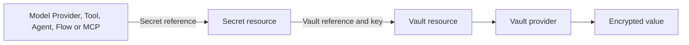

# Secrets and Vaults

Agentstration resources never store credentials directly. A consumer such as a Model Provider stores a reference to a `Secret`; the Secret stores a key and a reference to a `Vault`; only the Vault provider stores the value.



## Initialize a Local Vault from the Console

1. Open **Vaults**, create a Vault with provider **Local**, and save it.
2. Open the Vault details page. An unavailable Local Vault displays **Initialize Local Vault**.
3. Confirm **Generate master key**.
4. Record and back up the file path displayed by the Console.

The browser does not generate, receive, or display the master key. The authenticated administrator request only tells the server to initialize the Vault. The server generates 32 cryptographically random bytes, Base64-encodes them, and creates the key file using create-only semantics. A concurrent or repeated request cannot overwrite an existing key.

By default the generated file is `secrets/master.key` under the configured `Data:Directory`. For example, with the default Web data directory it is under `src/Agentstration.Web/.agentstration/secrets/master.key`. If `AGENTSTRATION_MASTER_KEY_FILE` is set, that exact path is used instead.

The operation is available only to the `Administrator` policy. Its response contains the status and absolute key-file path, never the key material.

:::warning
Back up the master-key file separately from the encrypted secret payloads. If the key is lost, existing Local Vault values cannot be decrypted. If the key is copied, anyone with both the key and encrypted payloads may decrypt them.
:::

## Configure the master key outside the Console

Production deployments should normally mount a protected file and set:

```text
AGENTSTRATION_MASTER_KEY_FILE=/run/secrets/agentstration-master-key
```

The file must contain exactly one Base64-encoded 32-byte key. `AGENTSTRATION_MASTER_KEY` accepts the same value directly for development and bootstrap scenarios, but environment variables are more likely to be exposed through process inspection or deployment diagnostics and are not the preferred production mechanism.

If either a configured key file already exists or `AGENTSTRATION_MASTER_KEY` is present, Console initialization returns a conflict and does not modify anything.

## Create and use a Secret

1. Open **Secrets** and create a Secret.
2. Enter the human-readable **Display name** first. The Console derives **Name** and **Vault key** automatically.
3. Select the Vault and keep type **opaque**.
4. Review the generated identifiers and customize them only when the Vault requires a different storage key.
5. Save the Secret resource.
6. Use **Set value** or **Replace value**. The field is cleared after saving.
7. In a consuming resource, use the Secret selector. Only the Secret resource reference is persisted.

For example, the Display name `Clé OpenAI — Production` produces:

```text
Name:      cle-openai-production
Vault key: cle-openai-production
```

**Name** identifies the Agentstration Secret resource and is used in its resource reference. **Vault key** identifies the entry inside the selected Vault. They are identical by default but remain separate because an external Vault may require a path such as `applications/agentstration/prod/openai/api-key`.

While creating the Secret, changing **Display name** updates both generated identifiers. Changing **Name** manually also updates **Vault key** until the Vault key itself is edited. After a field is customized manually, the Console preserves that customization. Existing Secret names are immutable when editing their metadata.

Secret values are write-only in the Management Plane. Resource reads, lists, YAML exports, Console state, and usage references contain only metadata and status such as `Configured` or `Missing`. There is deliberately no reveal action and no `GET` value endpoint.

The value operations are:

```text
PUT    /api/secrets/{name}/value
DELETE /api/secrets/{name}/value
```

Local Vault payloads use AES-256-GCM with a fresh nonce for every write. The encryption format, ciphertext, nonce, and authentication tag are stored separately from Management resource metadata. Runtime components resolve a Secret as late as possible through `ISecretResolver` and the provider registered for its Vault.

## Operational rules

- Never commit `master.key`, `*.secret`, or a real exported credential.
- Back up the master key and encrypted payloads through separate protected procedures.
- Restore the same master key when restoring encrypted payloads.
- Replacing the master key does not re-encrypt existing values; they become unreadable.
- Deleting a Secret value removes its Vault payload. Deleting the Secret resource never reveals the old value.
- Logs, telemetry, exceptions, audit payloads, and SignalR messages must not contain key material or Secret values.
- Vault bootstrap credentials are platform credentials, not ordinary Agentstration Secrets; this avoids recursive Vault dependencies.

V1 does not implement reveal, rotation, version history, leasing, dynamic credentials, PKI, cloud Vault providers, or complete RBAC.
